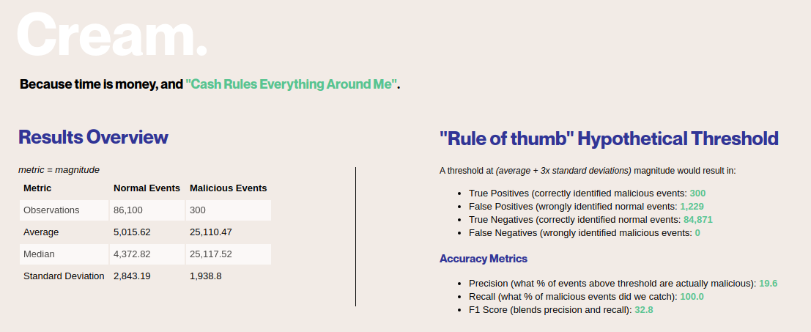
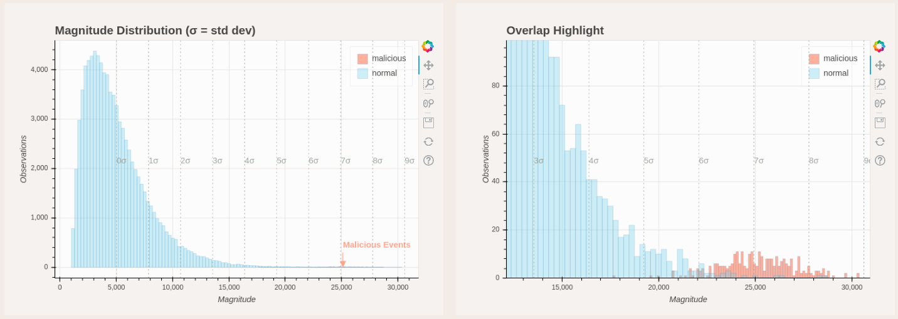
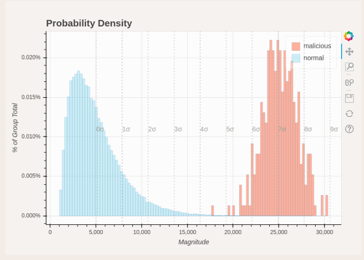
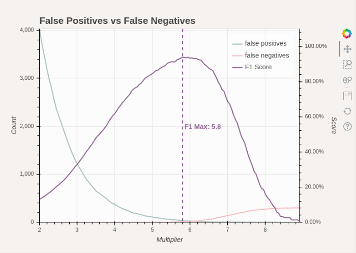
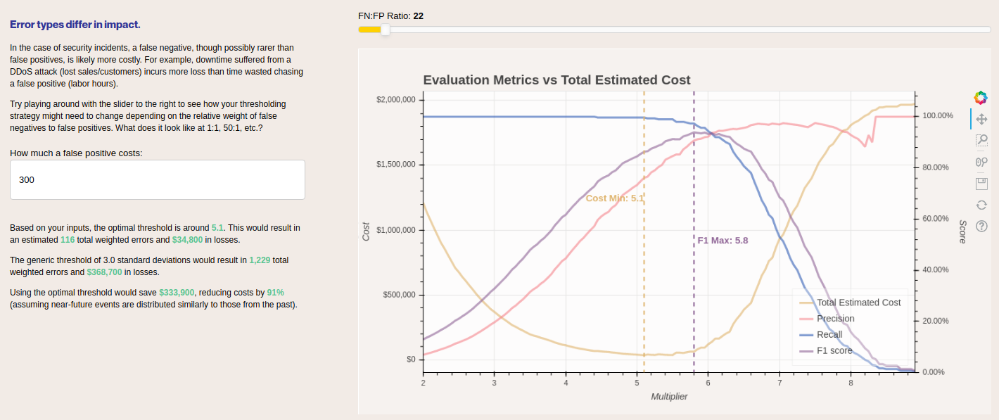

```bash
  ______      _______       ________       ______       __       __
 /      \    /        \    /        |    /        \    /  \     /  |
/$$$$$$  |   $$$$$$$  |    $$$$$$$$/     /$$$$$$  |    $$  \   /$$ |
$$ |  $$/    $$ |__$$ |    $$ |__        $$ |__$$ |    $$$  \ /$$$ |
$$ |         $$    $$<     $$    |       $$    $$ |    $$$$  /$$$$ |
$$ |   __    $$$$$$$  |    $$$$$/        $$$$$$$$ |    $$ $$ $$/$$ |
$$ \__/  |__ $$ |  $$ | __ $$ |_____  __ $$ |  $$ | __ $$ |$$$/ $$ |
$$    $$//  |$$ |  $$ |/  |$$       |/  |$$ |  $$ |/  |$$ | $/  $$ |
$$$$$$/  $$/ $$/   $$/ $$/ $$$$$$$$/ $$/ $$/   $$/ $$/ $$/      $$/

"Cash rules everything around me
CREAM get the money, dolla dolla bill, y'all"
- Wu-Tang Clan
```

# **Quickstart**
If you want to dive straight in because you've heard of this tool before, simply initiate the `launcher.py` file. It will take care of all the dependencies you'll need, and will ask you for all the arguments required.

You will, however, need to provide a CSV dataset with two crucial fields:
- **Metric**: whatever you'll be applying the threshold on
- **Classifier**: 1/0 labeling for malicious vs not malicious records

Other than that, follow the instructions and you should be fine!

You can also try taking a peek at the following demo files:
- demo_dashboard.html
- demo_simulation_results.csv
- simulated_ddos_data.csv (sample data)

# **Intro**
If you work in SIEMs, you might have tried to use statistical analysis to find malicious activity. You may have been suggested to use something around three standard deviations away from the mean (average) as a threshold; anything past that is generally an outlier.

https://www.splunk.com/en_us/resources/videos/splunk-for-security-investigation-ransomware.html

While this might catch outliers, you may also find this threshold generating much more false positives depending on how your data is distributed. This can be due to:
- Non-normal (not perfectly bell-shaped) distributions - this happens often in the wild.
- Sample proportions: even if sample points outside 3 standard deviations are improbable, they are still possible. With malicious events being rarer than normal ones, false positives might still be predominant above our threshold.

If we find ourselves stuck in that scenario, it would not be very efficient or effective to just keep nudging our threshold up until we don't have any more false positives - we might end up filtering out the real malicious events instead!

So how do we go about solving this problem?


## **Our solution**
There are three metrics that help us evaluate the efficacy of a threshold:
- **Precision**: out of all the events above the threshold, how many are actually malicious?
- **Recall**: what percentage of all malicious events did we catch?
- **F1 Score**: a blended metric between precision and recall

Instead of playing the wait and see game, we could simulate the results of a range of thresholds against our historical data. With this 'sensitivity analysis', we can pick out a point or subrange that seems to have higher F1 scores, maximizing the value of our threshold.

It's not perfect as the future may not entirely conform to the past, but certainly better than following a generic prescription blindly.

# **Interpreting Results**

When the script finishes running, it will open up an HTML dashboard summarizing your data and the simulations that were ran.



Some summary stats describing the normal and malicious samples, as well as the hypothetical results of the generically prescribed threshold at 3 standard deviations.



A view of how the normal vs malicious data are distributed. If they are close in proximity and show a fair amount of overlap, it is possible that this metric is not the best signal to place a threshold on.



A plot of the 'probability density' of the distributions. This shows the percentage of the sample that falls under a particular bin (area of the rectangle).



A high-level view of how false positive and false negative counts change alongside the standard deviation multiplier.



Here we can apply additional nuance with your own business context:
- Move the slider to indicate how much more costly a false negative is compared to a false positive.
- Enter in the estimated cost of a false positive to estimate total costs in conjunction with weighted false negatives.

You should find that the greater the weight against false negatives, the more the ideal threshold will move towards the left away from the peak of the F1 score curve. This indicates that the heavier the weighting, the more we should be willing to accept false positives in order to not let false negatives slip through. 

